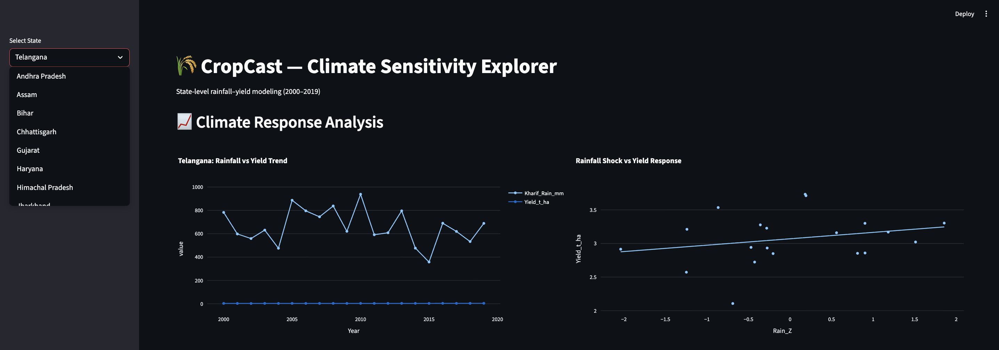
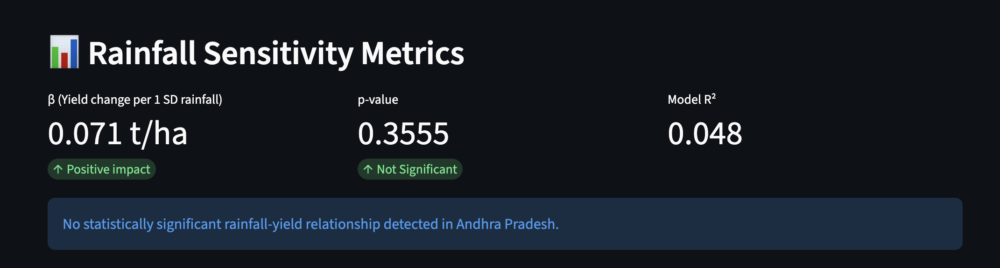
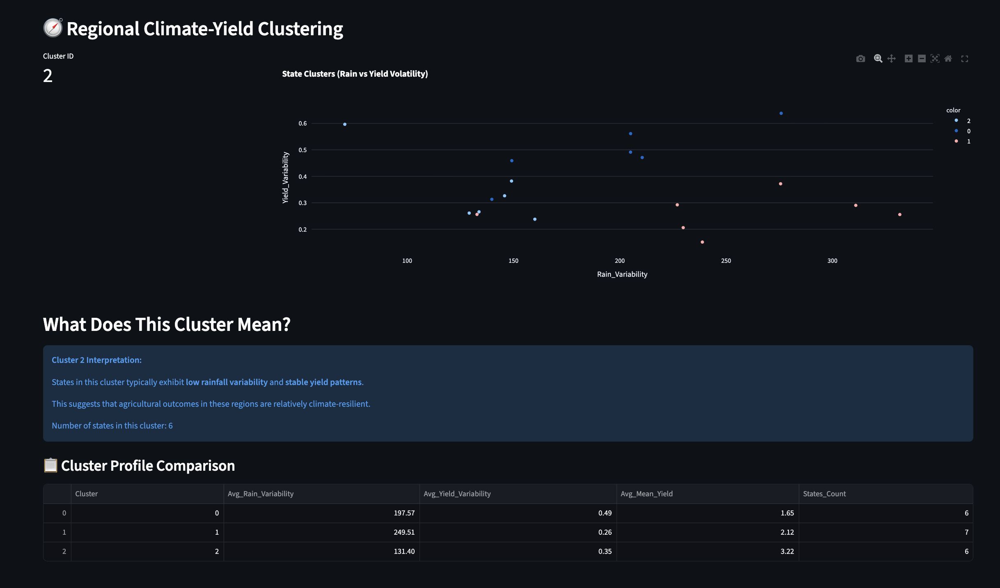

# 🌾 CropCast

**Climate-driven ML forecasting of rice yields in India (2000–2019)**

CropCast explores the climate–agriculture nexus by combining satellite-derived monsoon rainfall with state-level rice yield statistics to model and forecast agricultural outcomes under varying climate scenarios.

---

## 🌍 Overview

- Study domain: India (20 major rice-producing states)
- Time window: 2000–2019 (20 years)
- Crop: Rice (Kharif season)
- Climate driver: Monsoon rainfall (NASA POWER)
- Outcome: Yield (ICRISAT DLD)
- Methods: Data engineering + ML forecasting + clustering

---

## 📦 Dataset Pipeline

**1. Yield Data (DLD)**
- Source: ICRISAT District Level Database
- Aggregation: District → State
- Units: t/ha

**2. Rainfall Data (NASA POWER)**
- Source: NASA POWER API
- Variable: `PRECTOTCORR`
- Unit: mm/day → converted to mm/season
- Season: June–September (Kharif)

**3. Merge**
- Keys: `State`, `Year`
- Rows: 20 × 20 = 400 observations

---

## 🤖 Methods

- Rainfall anomaly standardization (Z-score)
- State-level regression (OLS rainfall–yield sensitivity)
- KMeans clustering of climate exposure profiles
- Shock scenario analysis (±1 SD rainfall)

---

## 🌱 Motivation

Rice is India’s most climate-sensitive staple crop. Kharif yield depends on monsoon rainfall; understanding this dependency supports sustainable agriculture and climate adaptation.

---
## 📊 Dashboard Preview

### Main Dashboard View


### Rainfall Sensitivity Metrics


### Cluster Visualization

---

## 📁 Repository Structure
```txt
CropCast/
├── data/
│   ├── raw/            # raw DLD + NASA data
│   └── processed/      # merged panel dataset
├── src/                # pipeline scripts
├── notebooks/          # exploration + forecasting notebooks
├── requirements.txt    # dependencies
└── README.md
```
---

## Author

Nakshatra  
CropCast Project — 2026
